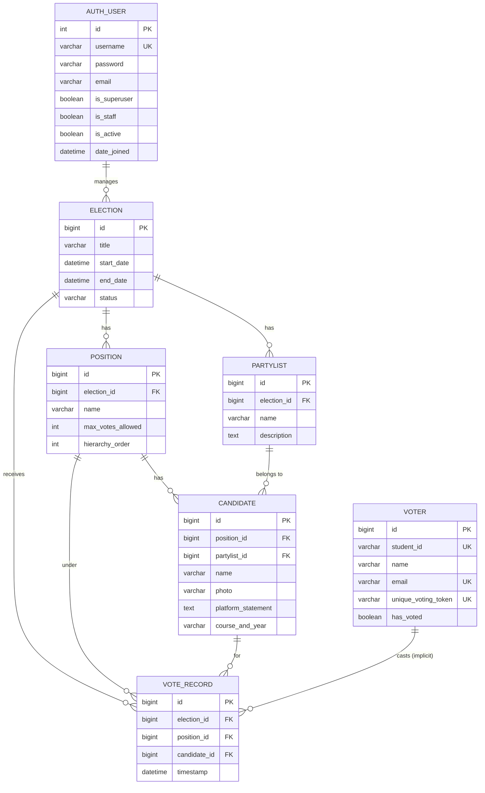
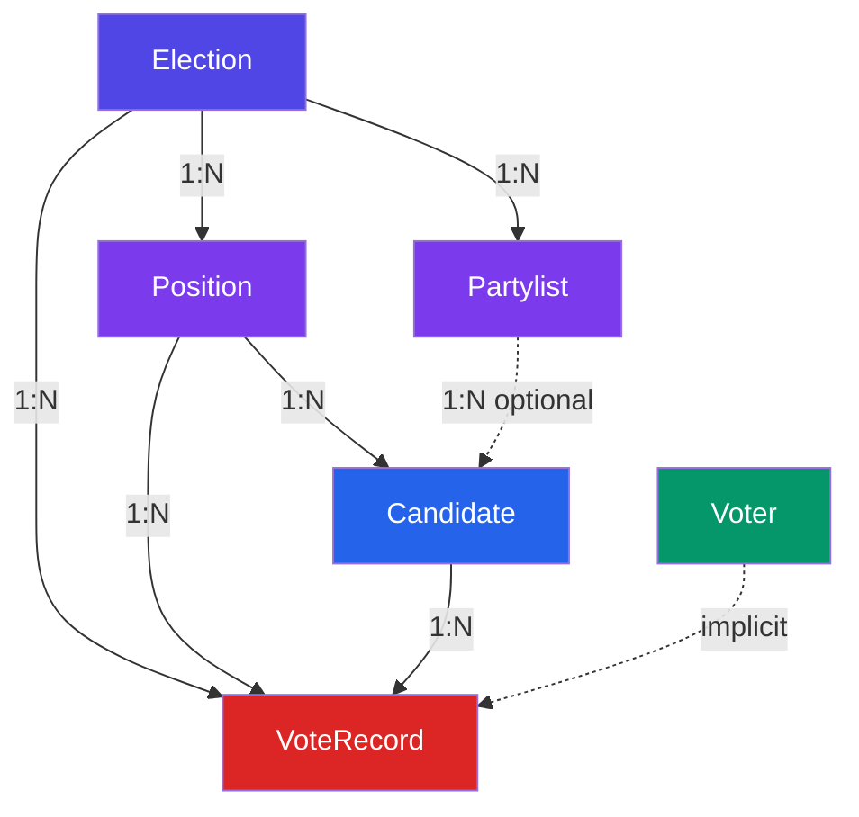
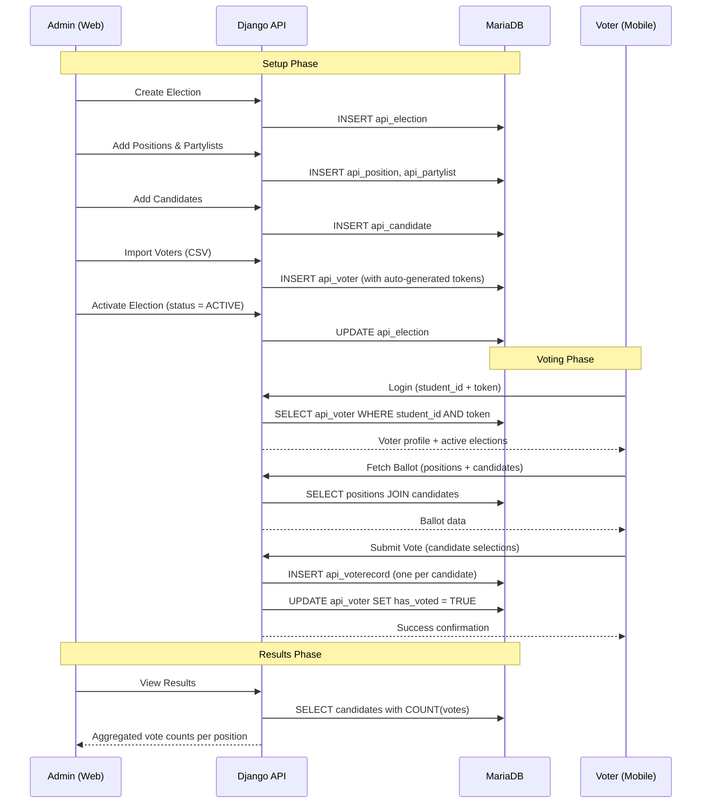

# Database Design — SOAVS (Student Organization Automated Voting System)

> **System**: Django 4.2 + MariaDB/MySQL  
> **Database Name**: `voting`  
> **Date**: April 27, 2026

---

## Entity-Relationship Diagram

---

## Table Specifications

### 1. `api_election` — Elections

The central entity. Each election represents a single voting event (e.g., "SSC Election 2026").

| Column | Type | Constraints | Description |
|--------|------|-------------|-------------|
| `id` | `BIGINT` | `PK`, `AUTO_INCREMENT` | Unique election identifier |
| `title` | `VARCHAR(255)` | `NOT NULL` | Display name of the election |
| `start_date` | `DATETIME(6)` | `NOT NULL` | When voting opens |
| `end_date` | `DATETIME(6)` | `NOT NULL` | When voting closes |
| `status` | `VARCHAR(20)` | `NOT NULL`, `DEFAULT 'DRAFT'` | Current state: `DRAFT`, `ACTIVE`, or `COMPLETED` |

> [!NOTE]
> The `calculated_status` property is computed at runtime in the Django model (not stored). It derives the real-time status based on `status`, `start_date`, and `end_date`, adding an `UPCOMING` state when the election is published but hasn't started yet.

**Business Rules:**
- `start_date` must be before `end_date`
- Status transitions: `DRAFT` → `ACTIVE` → `COMPLETED`
- An election in `DRAFT` status is invisible to voters on the mobile app

---

### 2. `api_position` — Positions / Offices

Defines the offices being contested in an election (e.g., President, Vice President, Senator).

| Column | Type | Constraints | Description |
|--------|------|-------------|-------------|
| `id` | `BIGINT` | `PK`, `AUTO_INCREMENT` | Unique position identifier |
| `election_id` | `BIGINT` | `FK → api_election(id)`, `NOT NULL` | Parent election |
| `name` | `VARCHAR(150)` | `NOT NULL` | Position title (e.g., "President") |
| `max_votes_allowed` | `INT` | `NOT NULL`, `DEFAULT 1` | Max candidates a voter can select for this position |
| `hierarchy_order` | `INT` | `NOT NULL`, `DEFAULT 0` | Display ordering (lower = higher rank) |

**Relationships:**
- Belongs to one `Election` (`CASCADE` on delete)
- Has many `Candidates`
- Has many `VoteRecords`

**Default Ordering:** `hierarchy_order ASC`

---

### 3. `api_partylist` — Partylists / Political Parties

Groups candidates under a political party or slate.

| Column | Type | Constraints | Description |
|--------|------|-------------|-------------|
| `id` | `BIGINT` | `PK`, `AUTO_INCREMENT` | Unique partylist identifier |
| `election_id` | `BIGINT` | `FK → api_election(id)`, `NOT NULL` | Parent election |
| `name` | `VARCHAR(150)` | `NOT NULL` | Partylist name (e.g., "Unity Party") |
| `description` | `TEXT` | `NULLABLE` | Optional description or platform |

**Relationships:**
- Belongs to one `Election` (`CASCADE` on delete)
- Has many `Candidates`

---

### 4. `api_candidate` — Candidates

Individuals running for a specific position in an election.

| Column | Type | Constraints | Description |
|--------|------|-------------|-------------|
| `id` | `BIGINT` | `PK`, `AUTO_INCREMENT` | Unique candidate identifier |
| `position_id` | `BIGINT` | `FK → api_position(id)`, `NOT NULL` | Position being contested |
| `partylist_id` | `BIGINT` | `FK → api_partylist(id)`, `NULLABLE` | Optional partylist affiliation |
| `name` | `VARCHAR(255)` | `NOT NULL` | Full name of the candidate |
| `photo` | `VARCHAR(100)` | `NULLABLE` | Path to candidate photo (uploaded to `candidate_photos/`) |
| `platform_statement` | `TEXT` | `NULLABLE` | Campaign platform or slogan |
| `course_and_year` | `VARCHAR(150)` | `NULLABLE` | Academic info (e.g., "BSCS 3rd Year") |

**Relationships:**
- Belongs to one `Position` (`CASCADE` on delete)
- Optionally belongs to one `Partylist` (`SET_NULL` on delete)
- Has many `VoteRecords`

> [!IMPORTANT]
> When a partylist is deleted, candidates remain but their `partylist_id` is set to `NULL` (via `SET_NULL`). When a position is deleted, all its candidates are deleted (`CASCADE`).

---

### 5. `api_voter` — Registered Voters

Students eligible to vote. Imported via CSV by the admin.

| Column | Type | Constraints | Description |
|--------|------|-------------|-------------|
| `id` | `BIGINT` | `PK`, `AUTO_INCREMENT` | Unique voter identifier |
| `student_id` | `VARCHAR(50)` | `UNIQUE`, `NOT NULL` | University student ID number |
| `name` | `VARCHAR(255)` | `NOT NULL` | Full name |
| `email` | `VARCHAR(254)` | `UNIQUE`, `NOT NULL` | Institutional email address |
| `unique_voting_token` | `VARCHAR(64)` | `UNIQUE`, `NOT NULL` | Auto-generated 32-char random token for authentication |
| `has_voted` | `BOOLEAN` | `NOT NULL`, `DEFAULT FALSE` | Whether the voter has already cast their ballot |

**Business Rules:**
- `unique_voting_token` is auto-generated on first save if blank
- A voter authenticates on the mobile app using `student_id` + `unique_voting_token`
- Once `has_voted = TRUE`, the voter is permanently locked out from voting again
- CSV import uses `student_id` as the deduplication key via `get_or_create`

> [!WARNING]
> The voter entity is **election-agnostic** — a voter is not scoped to a specific election. The `has_voted` flag is global, meaning once a voter casts a ballot in **any** election, they cannot vote in subsequent elections. This is a known design limitation.

---

### 6. `api_voterecord` — Vote Records

Each row represents a single vote cast for one candidate in one position.

| Column | Type | Constraints | Description |
|--------|------|-------------|-------------|
| `id` | `BIGINT` | `PK`, `AUTO_INCREMENT` | Unique vote record identifier |
| `election_id` | `BIGINT` | `FK → api_election(id)`, `NOT NULL` | The election this vote belongs to |
| `position_id` | `BIGINT` | `FK → api_position(id)`, `NOT NULL` | The position being voted on |
| `candidate_id` | `BIGINT` | `FK → api_candidate(id)`, `NOT NULL` | The candidate receiving the vote |
| `timestamp` | `DATETIME(6)` | `NOT NULL`, `AUTO_NOW_ADD` | When the vote was cast |

**Relationships:**
- Belongs to one `Election` (`CASCADE` on delete)
- Belongs to one `Position` (`CASCADE` on delete)
- Belongs to one `Candidate` (`CASCADE` on delete)

> [!NOTE]
> Vote records are **anonymous** — there is no foreign key back to the `Voter` table. This is by design to ensure **ballot secrecy**. The system only tracks *that* a voter has voted (via `has_voted`), not *how* they voted.

---

### 7. `auth_user` — Admin Users (Django Built-in)

Standard Django authentication. Used exclusively for admin dashboard access (JWT-based).

| Column | Type | Constraints | Description |
|--------|------|-------------|-------------|
| `id` | `INT` | `PK`, `AUTO_INCREMENT` | Unique user identifier |
| `username` | `VARCHAR(150)` | `UNIQUE`, `NOT NULL` | Admin login username |
| `password` | `VARCHAR(128)` | `NOT NULL` | Hashed password (PBKDF2-SHA256) |
| `email` | `VARCHAR(254)` | | Admin email |
| `is_superuser` | `BOOLEAN` | `NOT NULL` | Full admin privileges |
| `is_staff` | `BOOLEAN` | `NOT NULL` | Can access Django admin |
| `is_active` | `BOOLEAN` | `NOT NULL` | Account enabled/disabled |
| `last_login` | `DATETIME(6)` | `NULLABLE` | Last login timestamp |
| `date_joined` | `DATETIME(6)` | `NOT NULL` | Account creation date |

---

## Relationship Summary

| Parent | Child | Type | On Delete | Description |
|--------|-------|------|-----------|-------------|
| Election | Position | 1:N | CASCADE | Deleting an election removes all positions |
| Election | Partylist | 1:N | CASCADE | Deleting an election removes all partylists |
| Election | VoteRecord | 1:N | CASCADE | Deleting an election removes all vote records |
| Position | Candidate | 1:N | CASCADE | Deleting a position removes all candidates |
| Partylist | Candidate | 1:N | SET_NULL | Deleting a partylist nullifies candidate references |
| Position | VoteRecord | 1:N | CASCADE | Deleting a position removes related vote records |
| Candidate | VoteRecord | 1:N | CASCADE | Deleting a candidate removes their vote records |
| Voter | VoteRecord | — | *none* | **No FK link** (ballot secrecy by design) |

---

## Indexing Strategy

| Table | Index | Type | Purpose |
|-------|-------|------|---------|
| `api_voter` | `student_id` | UNIQUE | Fast login lookup |
| `api_voter` | `email` | UNIQUE | Deduplication |
| `api_voter` | `unique_voting_token` | UNIQUE | Token-based authentication |
| `api_candidate` | `partylist_id` | INDEX | Filter candidates by partylist |
| `api_candidate` | `position_id` | INDEX | Filter candidates by position |
| `api_partylist` | `election_id` | INDEX | Filter partylists by election |
| `api_position` | `election_id` | INDEX | Filter positions by election |
| `api_voterecord` | `candidate_id` | INDEX | Count votes per candidate (results) |
| `api_voterecord` | `election_id` | INDEX | Filter votes by election |
| `api_voterecord` | `position_id` | INDEX | Filter votes by position |

---

## Data Flow Summary

---

## Cardinality Summary Table

| Entity A | Relationship | Entity B | Cardinality |
|----------|-------------|----------|-------------|
| Election | has | Position | 1 : N |
| Election | has | Partylist | 1 : N |
| Election | receives | VoteRecord | 1 : N |
| Position | has | Candidate | 1 : N |
| Partylist | groups | Candidate | 1 : N (optional) |
| Position | under | VoteRecord | 1 : N |
| Candidate | for | VoteRecord | 1 : N |
| Voter | casts | VoteRecord | 1 : N (implicit, no FK) |
| Admin (auth_user) | manages | Election | 1 : N (via API permissions) |

---

## Key Design Decisions

> [!TIP]
> **Ballot Secrecy**: Vote records intentionally have no foreign key to the voter table. The system only knows *that* a voter has voted, never *who* they voted for. This is a critical privacy feature.

> [!TIP]
> **Token-Based Voter Auth**: Instead of passwords, voters use a pre-generated random token paired with their student ID. Tokens are distributed by the admin (e.g., printed voter cards) — no registration flow is needed on the mobile app.

> [!WARNING]
> **Single-Election Voter Lock**: The current `has_voted` flag is global. To support multi-election voting, consider adding a `VoterElection` junction table that tracks per-election voting status.

## SQL Schema Dump

`sql
-- phpMyAdmin SQL Dump
-- version 5.2.1
-- https://www.phpmyadmin.net/
--
-- Host: 127.0.0.1
-- Generation Time: Apr 22, 2026 at 12:46 PM
-- Server version: 10.4.32-MariaDB
-- PHP Version: 8.2.12

SET SQL_MODE = "NO_AUTO_VALUE_ON_ZERO";
START TRANSACTION;
SET time_zone = "+00:00";

/*!40101 SET @OLD_CHARACTER_SET_CLIENT=@@CHARACTER_SET_CLIENT */;
/*!40101 SET @OLD_CHARACTER_SET_RESULTS=@@CHARACTER_SET_RESULTS */;
/*!40101 SET @OLD_COLLATION_CONNECTION=@@COLLATION_CONNECTION */;
/*!40101 SET NAMES utf8mb4 */;

--
-- Database: `voting`
--

-- --------------------------------------------------------

--
-- Table structure for table `api_candidate`
--

CREATE TABLE `api_candidate` (
  `id` bigint(20) NOT NULL,
  `name` varchar(255) NOT NULL,
  `photo` varchar(100) DEFAULT NULL,
  `platform_statement` longtext DEFAULT NULL,
  `course_and_year` varchar(150) DEFAULT NULL,
  `partylist_id` bigint(20) DEFAULT NULL,
  `position_id` bigint(20) NOT NULL
) ENGINE=InnoDB DEFAULT CHARSET=utf8mb4 COLLATE=utf8mb4_general_ci;

-- --------------------------------------------------------

--
-- Table structure for table `api_election`
--

CREATE TABLE `api_election` (
  `id` bigint(20) NOT NULL,
  `title` varchar(255) NOT NULL,
  `start_date` datetime(6) NOT NULL,
  `end_date` datetime(6) NOT NULL,
  `status` varchar(20) NOT NULL
) ENGINE=InnoDB DEFAULT CHARSET=utf8mb4 COLLATE=utf8mb4_general_ci;

-- --------------------------------------------------------

--
-- Table structure for table `api_partylist`
--

CREATE TABLE `api_partylist` (
  `id` bigint(20) NOT NULL,
  `name` varchar(150) NOT NULL,
  `description` longtext DEFAULT NULL,
  `election_id` bigint(20) NOT NULL
) ENGINE=InnoDB DEFAULT CHARSET=utf8mb4 COLLATE=utf8mb4_general_ci;

-- --------------------------------------------------------

--
-- Table structure for table `api_position`
--

CREATE TABLE `api_position` (
  `id` bigint(20) NOT NULL,
  `name` varchar(150) NOT NULL,
  `max_votes_allowed` int(11) NOT NULL,
  `hierarchy_order` int(11) NOT NULL,
  `election_id` bigint(20) NOT NULL
) ENGINE=InnoDB DEFAULT CHARSET=utf8mb4 COLLATE=utf8mb4_general_ci;

-- --------------------------------------------------------

--
-- Table structure for table `api_voter`
--

CREATE TABLE `api_voter` (
  `id` bigint(20) NOT NULL,
  `student_id` varchar(50) NOT NULL,
  `name` varchar(255) NOT NULL,
  `email` varchar(254) NOT NULL,
  `unique_voting_token` varchar(64) NOT NULL,
  `has_voted` tinyint(1) NOT NULL
) ENGINE=InnoDB DEFAULT CHARSET=utf8mb4 COLLATE=utf8mb4_general_ci;

-- --------------------------------------------------------

--
-- Table structure for table `api_voterecord`
--

CREATE TABLE `api_voterecord` (
  `id` bigint(20) NOT NULL,
  `timestamp` datetime(6) NOT NULL,
  `candidate_id` bigint(20) NOT NULL,
  `election_id` bigint(20) NOT NULL,
  `position_id` bigint(20) NOT NULL
) ENGINE=InnoDB DEFAULT CHARSET=utf8mb4 COLLATE=utf8mb4_general_ci;

-- --------------------------------------------------------

--
-- Table structure for table `auth_group`
--

CREATE TABLE `auth_group` (
  `id` int(11) NOT NULL,
  `name` varchar(150) NOT NULL
) ENGINE=InnoDB DEFAULT CHARSET=utf8mb4 COLLATE=utf8mb4_general_ci;

-- --------------------------------------------------------

--
-- Table structure for table `auth_group_permissions`
--

CREATE TABLE `auth_group_permissions` (
  `id` int(11) NOT NULL,
  `group_id` int(11) NOT NULL,
  `permission_id` int(11) NOT NULL
) ENGINE=InnoDB DEFAULT CHARSET=utf8mb4 COLLATE=utf8mb4_general_ci;

-- --------------------------------------------------------

--
-- Table structure for table `auth_permission`
--

CREATE TABLE `auth_permission` (
  `id` int(11) NOT NULL,
  `name` varchar(255) NOT NULL,
  `content_type_id` int(11) NOT NULL,
  `codename` varchar(100) NOT NULL
) ENGINE=InnoDB DEFAULT CHARSET=utf8mb4 COLLATE=utf8mb4_general_ci;

--
-- Dumping data for table `auth_permission`
--

INSERT INTO `auth_permission` (`id`, `name`, `content_type_id`, `codename`) VALUES
(1, 'Can add log entry', 1, 'add_logentry'),
(2, 'Can change log entry', 1, 'change_logentry'),
(3, 'Can delete log entry', 1, 'delete_logentry'),
(4, 'Can view log entry', 1, 'view_logentry'),
(5, 'Can add permission', 2, 'add_permission'),
(6, 'Can change permission', 2, 'change_permission'),
(7, 'Can delete permission', 2, 'delete_permission'),
(8, 'Can view permission', 2, 'view_permission'),
(9, 'Can add group', 3, 'add_group'),
(10, 'Can change group', 3, 'change_group'),
(11, 'Can delete group', 3, 'delete_group'),
(12, 'Can view group', 3, 'view_group'),
(13, 'Can add user', 4, 'add_user'),
(14, 'Can change user', 4, 'change_user'),
(15, 'Can delete user', 4, 'delete_user'),
(16, 'Can view user', 4, 'view_user'),
(17, 'Can add content type', 5, 'add_contenttype'),
(18, 'Can change content type', 5, 'change_contenttype'),
(19, 'Can delete content type', 5, 'delete_contenttype'),
(20, 'Can view content type', 5, 'view_contenttype'),
(21, 'Can add session', 6, 'add_session'),
(22, 'Can change session', 6, 'change_session'),
(23, 'Can delete session', 6, 'delete_session'),
(24, 'Can view session', 6, 'view_session'),
(25, 'Can add voter', 7, 'add_voter'),
(26, 'Can change voter', 7, 'change_voter'),
(27, 'Can delete voter', 7, 'delete_voter'),
(28, 'Can view voter', 7, 'view_voter'),
(29, 'Can add position', 8, 'add_position'),
(30, 'Can change position', 8, 'change_position'),
(31, 'Can delete position', 8, 'delete_position'),
(32, 'Can view position', 8, 'view_position'),
(33, 'Can add candidate', 9, 'add_candidate'),
(34, 'Can change candidate', 9, 'change_candidate'),
(35, 'Can delete candidate', 9, 'delete_candidate'),
(36, 'Can view candidate', 9, 'view_candidate'),
(37, 'Can add election', 10, 'add_election'),
(38, 'Can change election', 10, 'change_election'),
(39, 'Can delete election', 10, 'delete_election'),
(40, 'Can view election', 10, 'view_election'),
(41, 'Can add vote record', 11, 'add_voterecord'),
(42, 'Can change vote record', 11, 'change_voterecord'),
(43, 'Can delete vote record', 11, 'delete_voterecord'),
(44, 'Can view vote record', 11, 'view_voterecord'),
(45, 'Can add partylist', 12, 'add_partylist'),
(46, 'Can change partylist', 12, 'change_partylist'),
(47, 'Can delete partylist', 12, 'delete_partylist'),
(48, 'Can view partylist', 12, 'view_partylist');

-- --------------------------------------------------------

--
-- Table structure for table `auth_user`
--

CREATE TABLE `auth_user` (
  `id` int(11) NOT NULL,
  `password` varchar(128) NOT NULL,
  `last_login` datetime(6) DEFAULT NULL,
  `is_superuser` tinyint(1) NOT NULL,
  `username` varchar(150) NOT NULL,
  `first_name` varchar(150) NOT NULL,
  `last_name` varchar(150) NOT NULL,
  `email` varchar(254) NOT NULL,
  `is_staff` tinyint(1) NOT NULL,
  `is_active` tinyint(1) NOT NULL,
  `date_joined` datetime(6) NOT NULL
) ENGINE=InnoDB DEFAULT CHARSET=utf8mb4 COLLATE=utf8mb4_general_ci;

--
-- Dumping data for table `auth_user`
--

INSERT INTO `auth_user` (`id`, `password`, `last_login`, `is_superuser`, `username`, `first_name`, `last_name`, `email`, `is_staff`, `is_active`, `date_joined`) VALUES
(1, 'pbkdf2_sha256$600000$VMFFjt8Y2z2JmXPuqH3QI1$0P0QI+cHjIsuoiRRVCIrHU19RD8qpoElZ7TZ3sGmDDA=', NULL, 1, 'admin', '', '', 'admin@example.com', 1, 1, '2026-04-21 04:45:13.357152');

-- --------------------------------------------------------

--
-- Table structure for table `auth_user_groups`
--

CREATE TABLE `auth_user_groups` (
  `id` int(11) NOT NULL,
  `user_id` int(11) NOT NULL,
  `group_id` int(11) NOT NULL
) ENGINE=InnoDB DEFAULT CHARSET=utf8mb4 COLLATE=utf8mb4_general_ci;

-- --------------------------------------------------------

--
-- Table structure for table `auth_user_user_permissions`
--

CREATE TABLE `auth_user_user_permissions` (
  `id` int(11) NOT NULL,
  `user_id` int(11) NOT NULL,
  `permission_id` int(11) NOT NULL
) ENGINE=InnoDB DEFAULT CHARSET=utf8mb4 COLLATE=utf8mb4_general_ci;

-- --------------------------------------------------------

--
-- Table structure for table `django_admin_log`
--

CREATE TABLE `django_admin_log` (
  `id` int(11) NOT NULL,
  `action_time` datetime(6) NOT NULL,
  `object_id` longtext DEFAULT NULL,
  `object_repr` varchar(200) NOT NULL,
  `action_flag` smallint(5) UNSIGNED NOT NULL CHECK (`action_flag` >= 0),
  `change_message` longtext NOT NULL,
  `content_type_id` int(11) DEFAULT NULL,
  `user_id` int(11) NOT NULL
) ENGINE=InnoDB DEFAULT CHARSET=utf8mb4 COLLATE=utf8mb4_general_ci;

-- --------------------------------------------------------

--
-- Table structure for table `django_content_type`
--

CREATE TABLE `django_content_type` (
  `id` int(11) NOT NULL,
  `app_label` varchar(100) NOT NULL,
  `model` varchar(100) NOT NULL
) ENGINE=InnoDB DEFAULT CHARSET=utf8mb4 COLLATE=utf8mb4_general_ci;

--
-- Dumping data for table `django_content_type`
--

INSERT INTO `django_content_type` (`id`, `app_label`, `model`) VALUES
(1, 'admin', 'logentry'),
(9, 'api', 'candidate'),
(10, 'api', 'election'),
(12, 'api', 'partylist'),
(8, 'api', 'position'),
(7, 'api', 'voter'),
(11, 'api', 'voterecord'),
(3, 'auth', 'group'),
(2, 'auth', 'permission'),
(4, 'auth', 'user'),
(5, 'contenttypes', 'contenttype'),
(6, 'sessions', 'session');

-- --------------------------------------------------------

--
-- Table structure for table `django_migrations`
--

CREATE TABLE `django_migrations` (
  `id` int(11) NOT NULL,
  `app` varchar(255) NOT NULL,
  `name` varchar(255) NOT NULL,
  `applied` datetime(6) NOT NULL
) ENGINE=InnoDB DEFAULT CHARSET=utf8mb4 COLLATE=utf8mb4_general_ci;

--
-- Dumping data for table `django_migrations`
--

INSERT INTO `django_migrations` (`id`, `app`, `name`, `applied`) VALUES
(1, 'contenttypes', '0001_initial', '2026-04-21 04:11:07.236560'),
(2, 'auth', '0001_initial', '2026-04-21 04:11:08.373988'),
(3, 'admin', '0001_initial', '2026-04-21 04:11:08.681041'),
(4, 'admin', '0002_logentry_remove_auto_add', '2026-04-21 04:11:08.694229'),
(5, 'admin', '0003_logentry_add_action_flag_choices', '2026-04-21 04:11:08.707794'),
(6, 'contenttypes', '0002_remove_content_type_name', '2026-04-21 04:11:08.886893'),
(7, 'auth', '0002_alter_permission_name_max_length', '2026-04-21 04:11:09.003901'),
(8, 'auth', '0003_alter_user_email_max_length', '2026-04-21 04:11:09.033726'),
(9, 'auth', '0004_alter_user_username_opts', '2026-04-21 04:11:09.046535'),
(10, 'auth', '0005_alter_user_last_login_null', '2026-04-21 04:11:09.127736'),
(11, 'auth', '0006_require_contenttypes_0002', '2026-04-21 04:11:09.135090'),
(12, 'auth', '0007_alter_validators_add_error_messages', '2026-04-21 04:11:09.149125'),
(13, 'auth', '0008_alter_user_username_max_length', '2026-04-21 04:11:09.240251'),
(14, 'auth', '0009_alter_user_last_name_max_length', '2026-04-21 04:11:09.334126'),
(15, 'auth', '0010_alter_group_name_max_length', '2026-04-21 04:11:09.364761'),
(16, 'auth', '0011_update_proxy_permissions', '2026-04-21 04:11:09.379065'),
(17, 'auth', '0012_alter_user_first_name_max_length', '2026-04-21 04:11:09.409736'),
(18, 'sessions', '0001_initial', '2026-04-21 04:11:09.489197'),
(19, 'api', '0001_initial', '2026-04-21 04:14:47.538778');

-- --------------------------------------------------------

--
-- Table structure for table `django_session`
--

CREATE TABLE `django_session` (
  `session_key` varchar(40) NOT NULL,
  `session_data` longtext NOT NULL,
  `expire_date` datetime(6) NOT NULL
) ENGINE=InnoDB DEFAULT CHARSET=utf8mb4 COLLATE=utf8mb4_general_ci;

--
-- Indexes for dumped tables
--

--
-- Indexes for table `api_candidate`
--
ALTER TABLE `api_candidate`
  ADD PRIMARY KEY (`id`),
  ADD KEY `api_candidate_partylist_id_6a3cabb2_fk_api_partylist_id` (`partylist_id`),
  ADD KEY `api_candidate_position_id_b9bb2531_fk_api_position_id` (`position_id`);

--
-- Indexes for table `api_election`
--
ALTER TABLE `api_election`
  ADD PRIMARY KEY (`id`);

--
-- Indexes for table `api_partylist`
--
ALTER TABLE `api_partylist`
  ADD PRIMARY KEY (`id`),
  ADD KEY `api_partylist_election_id_0ddb0ea4_fk_api_election_id` (`election_id`);

--
-- Indexes for table `api_position`
--
ALTER TABLE `api_position`
  ADD PRIMARY KEY (`id`),
  ADD KEY `api_position_election_id_e983cc6b_fk_api_election_id` (`election_id`);

--
-- Indexes for table `api_voter`
--
ALTER TABLE `api_voter`
  ADD PRIMARY KEY (`id`),
  ADD UNIQUE KEY `student_id` (`student_id`),
  ADD UNIQUE KEY `email` (`email`),
  ADD UNIQUE KEY `unique_voting_token` (`unique_voting_token`);

--
-- Indexes for table `api_voterecord`
--
ALTER TABLE `api_voterecord`
  ADD PRIMARY KEY (`id`),
  ADD KEY `api_voterecord_candidate_id_33d0cd6b_fk_api_candidate_id` (`candidate_id`),
  ADD KEY `api_voterecord_election_id_958fd916_fk_api_election_id` (`election_id`),
  ADD KEY `api_voterecord_position_id_79cb36ca_fk_api_position_id` (`position_id`);

--
-- Indexes for table `auth_group`
--
ALTER TABLE `auth_group`
  ADD PRIMARY KEY (`id`),
  ADD UNIQUE KEY `name` (`name`);

--
-- Indexes for table `auth_group_permissions`
--
ALTER TABLE `auth_group_permissions`
  ADD PRIMARY KEY (`id`),
  ADD UNIQUE KEY `auth_group_permissions_group_id_permission_id_0cd325b0_uniq` (`group_id`,`permission_id`),
  ADD KEY `auth_group_permissio_permission_id_84c5c92e_fk_auth_perm` (`permission_id`);

--
-- Indexes for table `auth_permission`
--
ALTER TABLE `auth_permission`
  ADD PRIMARY KEY (`id`),
  ADD UNIQUE KEY `auth_permission_content_type_id_codename_01ab375a_uniq` (`content_type_id`,`codename`);

--
-- Indexes for table `auth_user`
--
ALTER TABLE `auth_user`
  ADD PRIMARY KEY (`id`),
  ADD UNIQUE KEY `username` (`username`);

--
-- Indexes for table `auth_user_groups`
--
ALTER TABLE `auth_user_groups`
  ADD PRIMARY KEY (`id`),
  ADD UNIQUE KEY `auth_user_groups_user_id_group_id_94350c0c_uniq` (`user_id`,`group_id`),
  ADD KEY `auth_user_groups_group_id_97559544_fk_auth_group_id` (`group_id`);

--
-- Indexes for table `auth_user_user_permissions`
--
ALTER TABLE `auth_user_user_permissions`
  ADD PRIMARY KEY (`id`),
  ADD UNIQUE KEY `auth_user_user_permissions_user_id_permission_id_14a6b632_uniq` (`user_id`,`permission_id`),
  ADD KEY `auth_user_user_permi_permission_id_1fbb5f2c_fk_auth_perm` (`permission_id`);

--
-- Indexes for table `django_admin_log`
--
ALTER TABLE `django_admin_log`
  ADD PRIMARY KEY (`id`),
  ADD KEY `django_admin_log_content_type_id_c4bce8eb_fk_django_co` (`content_type_id`),
  ADD KEY `django_admin_log_user_id_c564eba6_fk_auth_user_id` (`user_id`);

--
-- Indexes for table `django_content_type`
--
ALTER TABLE `django_content_type`
  ADD PRIMARY KEY (`id`),
  ADD UNIQUE KEY `django_content_type_app_label_model_76bd3d3b_uniq` (`app_label`,`model`);

--
-- Indexes for table `django_migrations`
--
ALTER TABLE `django_migrations`
  ADD PRIMARY KEY (`id`);

--
-- Indexes for table `django_session`
--
ALTER TABLE `django_session`
  ADD PRIMARY KEY (`session_key`),
  ADD KEY `django_session_expire_date_a5c62663` (`expire_date`);

--
-- AUTO_INCREMENT for dumped tables
--

--
-- AUTO_INCREMENT for table `api_candidate`
--
ALTER TABLE `api_candidate`
  MODIFY `id` bigint(20) NOT NULL AUTO_INCREMENT;

--
-- AUTO_INCREMENT for table `api_election`
--
ALTER TABLE `api_election`
  MODIFY `id` bigint(20) NOT NULL AUTO_INCREMENT;

--
-- AUTO_INCREMENT for table `api_partylist`
--
ALTER TABLE `api_partylist`
  MODIFY `id` bigint(20) NOT NULL AUTO_INCREMENT;

--
-- AUTO_INCREMENT for table `api_position`
--
ALTER TABLE `api_position`
  MODIFY `id` bigint(20) NOT NULL AUTO_INCREMENT;

--
-- AUTO_INCREMENT for table `api_voter`
--
ALTER TABLE `api_voter`
  MODIFY `id` bigint(20) NOT NULL AUTO_INCREMENT;

--
-- AUTO_INCREMENT for table `api_voterecord`
--
ALTER TABLE `api_voterecord`
  MODIFY `id` bigint(20) NOT NULL AUTO_INCREMENT;

--
-- AUTO_INCREMENT for table `auth_group`
--
ALTER TABLE `auth_group`
  MODIFY `id` int(11) NOT NULL AUTO_INCREMENT;

--
-- AUTO_INCREMENT for table `auth_group_permissions`
--
ALTER TABLE `auth_group_permissions`
  MODIFY `id` int(11) NOT NULL AUTO_INCREMENT;

--
-- AUTO_INCREMENT for table `auth_permission`
--
ALTER TABLE `auth_permission`
  MODIFY `id` int(11) NOT NULL AUTO_INCREMENT, AUTO_INCREMENT=49;

--
-- AUTO_INCREMENT for table `auth_user`
--
ALTER TABLE `auth_user`
  MODIFY `id` int(11) NOT NULL AUTO_INCREMENT, AUTO_INCREMENT=2;

--
-- AUTO_INCREMENT for table `auth_user_groups`
--
ALTER TABLE `auth_user_groups`
  MODIFY `id` int(11) NOT NULL AUTO_INCREMENT;

--
-- AUTO_INCREMENT for table `auth_user_user_permissions`
--
ALTER TABLE `auth_user_user_permissions`
  MODIFY `id` int(11) NOT NULL AUTO_INCREMENT;

--
-- AUTO_INCREMENT for table `django_admin_log`
--
ALTER TABLE `django_admin_log`
  MODIFY `id` int(11) NOT NULL AUTO_INCREMENT;

--
-- AUTO_INCREMENT for table `django_content_type`
--
ALTER TABLE `django_content_type`
  MODIFY `id` int(11) NOT NULL AUTO_INCREMENT, AUTO_INCREMENT=13;

--
-- AUTO_INCREMENT for table `django_migrations`
--
ALTER TABLE `django_migrations`
  MODIFY `id` int(11) NOT NULL AUTO_INCREMENT, AUTO_INCREMENT=20;

--
-- Constraints for dumped tables
--

--
-- Constraints for table `api_candidate`
--
ALTER TABLE `api_candidate`
  ADD CONSTRAINT `api_candidate_partylist_id_6a3cabb2_fk_api_partylist_id` FOREIGN KEY (`partylist_id`) REFERENCES `api_partylist` (`id`),
  ADD CONSTRAINT `api_candidate_position_id_b9bb2531_fk_api_position_id` FOREIGN KEY (`position_id`) REFERENCES `api_position` (`id`);

--
-- Constraints for table `api_partylist`
--
ALTER TABLE `api_partylist`
  ADD CONSTRAINT `api_partylist_election_id_0ddb0ea4_fk_api_election_id` FOREIGN KEY (`election_id`) REFERENCES `api_election` (`id`);

--
-- Constraints for table `api_position`
--
ALTER TABLE `api_position`
  ADD CONSTRAINT `api_position_election_id_e983cc6b_fk_api_election_id` FOREIGN KEY (`election_id`) REFERENCES `api_election` (`id`);

--
-- Constraints for table `api_voterecord`
--
ALTER TABLE `api_voterecord`
  ADD CONSTRAINT `api_voterecord_candidate_id_33d0cd6b_fk_api_candidate_id` FOREIGN KEY (`candidate_id`) REFERENCES `api_candidate` (`id`),
  ADD CONSTRAINT `api_voterecord_election_id_958fd916_fk_api_election_id` FOREIGN KEY (`election_id`) REFERENCES `api_election` (`id`),
  ADD CONSTRAINT `api_voterecord_position_id_79cb36ca_fk_api_position_id` FOREIGN KEY (`position_id`) REFERENCES `api_position` (`id`);

--
-- Constraints for table `auth_group_permissions`
--
ALTER TABLE `auth_group_permissions`
  ADD CONSTRAINT `auth_group_permissio_permission_id_84c5c92e_fk_auth_perm` FOREIGN KEY (`permission_id`) REFERENCES `auth_permission` (`id`),
  ADD CONSTRAINT `auth_group_permissions_group_id_b120cbf9_fk_auth_group_id` FOREIGN KEY (`group_id`) REFERENCES `auth_group` (`id`);

--
-- Constraints for table `auth_permission`
--
ALTER TABLE `auth_permission`
  ADD CONSTRAINT `auth_permission_content_type_id_2f476e4b_fk_django_co` FOREIGN KEY (`content_type_id`) REFERENCES `django_content_type` (`id`);

--
-- Constraints for table `auth_user_groups`
--
ALTER TABLE `auth_user_groups`
  ADD CONSTRAINT `auth_user_groups_group_id_97559544_fk_auth_group_id` FOREIGN KEY (`group_id`) REFERENCES `auth_group` (`id`),
  ADD CONSTRAINT `auth_user_groups_user_id_6a12ed8b_fk_auth_user_id` FOREIGN KEY (`user_id`) REFERENCES `auth_user` (`id`);

--
-- Constraints for table `auth_user_user_permissions`
--
ALTER TABLE `auth_user_user_permissions`
  ADD CONSTRAINT `auth_user_user_permi_permission_id_1fbb5f2c_fk_auth_perm` FOREIGN KEY (`permission_id`) REFERENCES `auth_permission` (`id`),
  ADD CONSTRAINT `auth_user_user_permissions_user_id_a95ead1b_fk_auth_user_id` FOREIGN KEY (`user_id`) REFERENCES `auth_user` (`id`);

--
-- Constraints for table `django_admin_log`
--
ALTER TABLE `django_admin_log`
  ADD CONSTRAINT `django_admin_log_content_type_id_c4bce8eb_fk_django_co` FOREIGN KEY (`content_type_id`) REFERENCES `django_content_type` (`id`),
  ADD CONSTRAINT `django_admin_log_user_id_c564eba6_fk_auth_user_id` FOREIGN KEY (`user_id`) REFERENCES `auth_user` (`id`);
COMMIT;

/*!40101 SET CHARACTER_SET_CLIENT=@OLD_CHARACTER_SET_CLIENT */;
/*!40101 SET CHARACTER_SET_RESULTS=@OLD_CHARACTER_SET_RESULTS */;
/*!40101 SET COLLATION_CONNECTION=@OLD_COLLATION_CONNECTION */;

`
